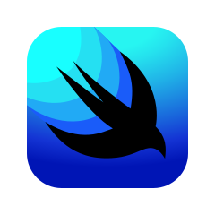

## Hello there, i'm Thyago Raphael!

<a href="https://www.linkedin.com/in/thyago-raphael-396b48215" target="_blank"></a> 

```swift
struct Dev {
  let name = "Thyago Raphael Almeida dos Santos"
  let age = Int.infinity
  let role = "iOS Developer"
  let location = "Brazil"
  let languages = ["pt_BR"]
  let skills = ["Swift", "UIKit (ViewCode)", "SwiftUI", "MVVM 🤡"]
  
  func sayHi() {
    print("Hi Dev!")
  }
}

let me = Dev()
me.sayHi()
```

## My skills include
<div style="display: inline_block">



</div
 
 [](https://github.com/thyagoraphael)
 <br />
 [](https://github.com/thyagoraphael/github-readme-stats)
